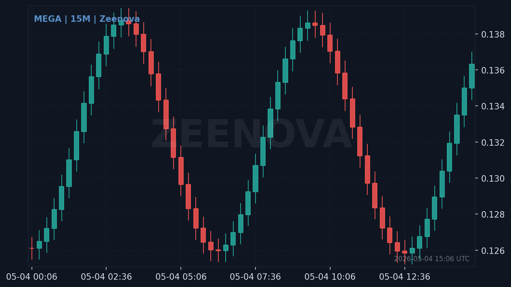

# Zeenova Coin Info Bot

Telegram bot that turns any chat into a crypto desk — live prices, charts,
calculator, conversions, and a market overview, all in one place.

Built for the **Zeen** community channels:

- Channel: <https://t.me/ox_zeen>
- Group:   <https://t.me/blockzeen>



## Features

### Live prices & charts
- Plain coin symbols (`btc`, `$eth`, `MEGA`) trigger a candlestick chart on
  a dark Zeenova-themed canvas plus a colour-coded price card (price, 24h
  change, high / low, marketcap, volume, rank).
- Inline timeframe buttons: **15M / 1H / 4H / 1D**.
- Resolves symbols across **Binance → Bybit → MEXC → CoinPaprika** so even
  small / off-exchange coins (`OCT`, `OPG`, …) get a price card. The
  off-exchange tail keeps things working for tickers that no major spot
  exchange lists yet.
- `/p SYMBOL` works in DMs and groups when free-text triggers are off.

### Inline mode
- Type `@<your_bot> btc` in **any** chat — even chats the bot isn't in —
  and pick a coin from the suggestions to forward a fresh price card.
  Requires inline mode to be enabled in BotFather (see *Telegram setup*).

### Market overview
- `/market` — total marketcap, 24h volume, BTC dominance, active coin
  count, plus a **Fear & Greed Index** dial rendered locally so the
  picture and caption value always agree (sourced from CoinMarketCap, the
  same index Binance Square uses).
- `/top` — the day's biggest gainers and losers from the top 100 by
  marketcap.
- `/news` — latest English-language crypto headlines aggregated from
  CoinDesk, Cointelegraph, and Decrypt via their public RSS feeds (no
  API key required). Deduplicated by URL and cached for 5 minutes.

### Calculator & conversions
- Plain math with full operator precedence: `2+3*4`, `(1+2)*3`, `2^10`,
  `10%3`.
- Suffixes: `1k`, `1.5m`, `2.5b`, `1.2t`.
- Percent operator: `100+10%` = `110`, `1000-0.1%` = `999`, `5%` = `0.05`.
- Currency conversion: `5 usd egp`, `300 star`, `3 usdt egp`,
  `1k mnt usd`. Worldwide fiat coverage; crypto symbols always win
  ambiguity (so `MNT` = Mantle, not Mongolian Tugrik).
- Group-friendly: stays silent on bare expressions like `50%` so it
  doesn't interrupt casual chat.

### Quote stickers
- Reply to any text message with just `z` (or `Z`) and the bot will turn
  the quoted message into a sticker — same idea as `@QuotLyBot`, in your
  own bot.

## Requirements

- Python **3.11+**
- A Telegram bot token from [@BotFather](https://t.me/BotFather)
- (Optional) A CoinGecko Pro API key — only needed if you outgrow the free
  tier's rate limits. The bot defaults to the public CoinPaprika /
  CoinGecko endpoints, no key required.

## Setup

```bash
git clone https://github.com/AO-SDD/Zeenova.git
cd Zeenova

python3.11 -m venv .venv
source .venv/bin/activate
pip install -r requirements.txt

cp .env.example .env
# edit .env and paste your TELEGRAM_BOT_TOKEN

python -m zeenova_bot.main
```

### Telegram setup

1. Talk to [@BotFather](https://t.me/BotFather) → `/newbot` → paste the
   token into `.env` as `TELEGRAM_BOT_TOKEN`.
2. To make the bot react to plain coin symbols (not just `/p`) inside a
   group, **disable Privacy Mode**:
   `/setprivacy` → choose your bot → **Disable**.
3. To enable inline mode (`@<bot> btc` in any chat):
   `/setinline` → choose your bot → optionally set a placeholder like
   `Search a coin (BTC, ETH, OCT)…`.
4. Add the bot to your group / channel as an admin (or member, if Privacy
   Mode is disabled it will see everything).

### Restricting the bot to specific chats

Set `ALLOWED_CHAT_IDS` in `.env` to a comma-separated list of chat IDs to
limit free-text triggers to those chats. Leave it blank to allow
everywhere.

### Available environment variables

| Variable | Required | Default | Notes |
|---|---|---|---|
| `TELEGRAM_BOT_TOKEN` | yes | — | Token from BotFather. |
| `COINGECKO_API_KEY` | no | empty | Optional Pro key. |
| `ALLOWED_CHAT_IDS` | no | empty | Comma-separated chat IDs. |
| `BRAND_NAME` | no | `Zeenova` | Watermark on chart + F&G dial. |
| `CHANNEL_NAME` | no | `Zeen Channel` | Footer on the price card. |
| `GROUP_NAME` | no | `Zeen Chat` | Footer on the price card. |
| `TELEGRAM_CHANNEL_URL` | no | `https://t.me/ox_zeen` | |
| `TELEGRAM_GROUP_URL` | no | `https://t.me/blockzeen` | |
| `LOG_LEVEL` | no | `INFO` | Standard Python logging level. |

## Docker

```bash
cp .env.example .env
# edit .env
docker compose up -d --build
```

## Development

```bash
make dev-install
make lint typecheck test
```

The repository ships with:

- `ruff` for linting / formatting (line length 100, strict rules)
- `mypy` in strict mode (`zeenova_bot` package only)
- `pytest` + `pytest-asyncio` for unit tests (235+ tests)

CI runs the same three commands on every push (`.github/workflows/ci.yml`).

## Architecture

```
zeenova_bot/
├── main.py          # Entrypoint; wires every client + handler together
├── config.py        # Pydantic settings loaded from .env
├── http.py          # Shared httpx client config (pool sizing, timeouts)
├── handlers.py      # python-telegram-bot wiring (commands, text, inline, callbacks)
├── services.py      # CoinService — resolves a symbol against all data sources
│
├── binance.py       # Primary price + kline source (deepest liquidity)
├── bybit.py         # First fallback (geo-blocked in some regions)
├── mexc.py          # Second fallback (widest free USDT catalogue)
├── coinpaprika.py   # Off-exchange snapshot for thinly-listed coins + /top + /market
├── coingecko.py     # Marketcap fallback when CoinPaprika doesn't know a ticker
├── marketcap.py     # CoinPaprika → CoinGecko marketcap aggregator
│
├── fear_greed.py    # CMC Fear & Greed client + local PIL dial renderer (cached)
├── news.py          # RSS news aggregator (CoinDesk, Cointelegraph, Decrypt)
├── fx.py            # Worldwide fiat + crypto conversion (cached)
├── calc.py          # Calculator: precedence, suffixes, %, conversions
├── quote_sticker.py # bot.lyo.su client for `z`-reply quote stickers
├── card.py          # Renders the HTML price-card body
├── chart.py         # Renders the candlestick PNG (mplfinance, off-loop)
└── timeframes.py    # 15M / 1H / 4H / 1D definitions
```

### Performance notes

- Every outbound HTTP client funnels through `http.shared_async_client`
  (200 max connections / 100 keepalive / 5 s connect timeout) so bursts
  of concurrent traffic reuse warm sockets.
- The Fear & Greed dial PNG is memoised on `(value, classification,
  brand)` and rendered in a dedicated thread pool, so /market answers
  almost instantly on repeat calls.
- Candlestick charts render in a single-worker thread pool because
  matplotlib's pyplot global state is not thread-safe.
- `AIORateLimiter` respects Telegram's per-chat (1 msg/s) and global
  (30 msg/s) caps automatically, so a single busy group can't trigger a
  global FloodWait.

## License

MIT — see `LICENSE`.
